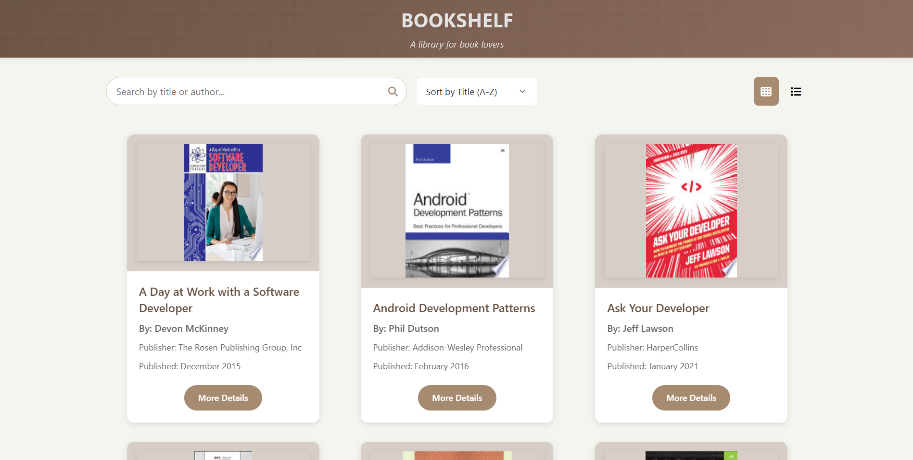
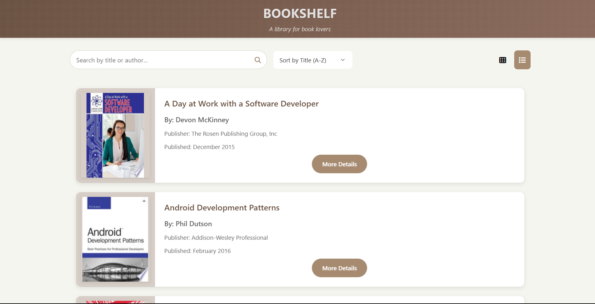
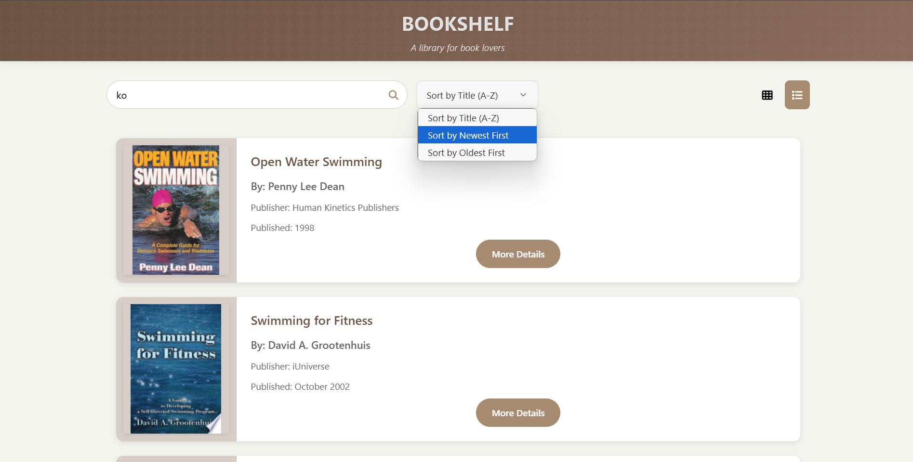
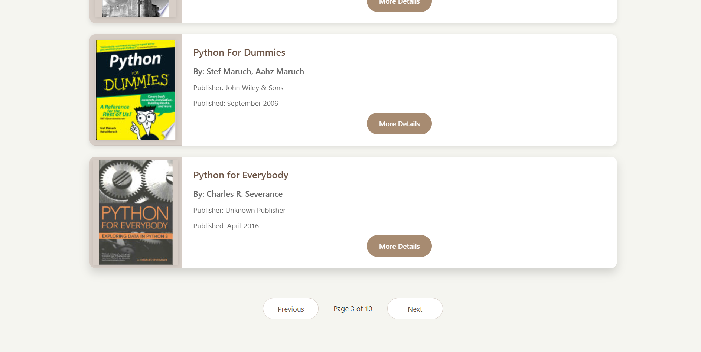

# Bookshelf - A Modern Book Library Application

A responsive and interactive web application for browsing and managing a collection of books. Built with vanilla JavaScript and modern CSS, this application provides a seamless experience for book lovers to explore their favorite titles.

## 📱 Application Interface









## 🌐 Live Demo
[View Live Application](https://bookshelf-pi-five.vercel.app/)

## 🚀 Features

### Core Features
- **Responsive Design**: Fully responsive layout that works seamlessly across desktop, tablet, and mobile devices
- **Dual View Modes**: 
  - Grid View: Perfect for visual browsing
  - List View: Ideal for detailed information scanning
- **Advanced Search**: Search books by title or author
- **Smart Sorting**: 
  - Sort by Title (A-Z)
  - Sort by Newest First
  - Sort by Oldest First
- **Pagination**: Efficient navigation through large book collections
- **Book Cards**: Beautiful and informative cards displaying:
  - Book cover image
  - Title
  - Author
  - Publisher
  - Publication date
  - Direct link to book details

### User Experience
- Smooth animations and transitions
- Intuitive interface
- Loading states and error handling
- Responsive image handling
- Hover effects and visual feedback

## 🛠️ Technologies Used
- HTML5
- CSS3 (with CSS Variables and Flexbox/Grid)
- Vanilla JavaScript
- Font Awesome Icons
- FreeAPI.app

## 🚀 Getting Started

### Prerequisites
- A modern web browser
- Basic understanding of HTML, CSS, and JavaScript

### Installation

1. Clone the repository
```bash
git clone https://github.com/your-username/bookshelf.git
```

2. Navigate to the project directory
```bash
cd bookshelf
```

3. Open `index.html` in your browser or use a local server

---